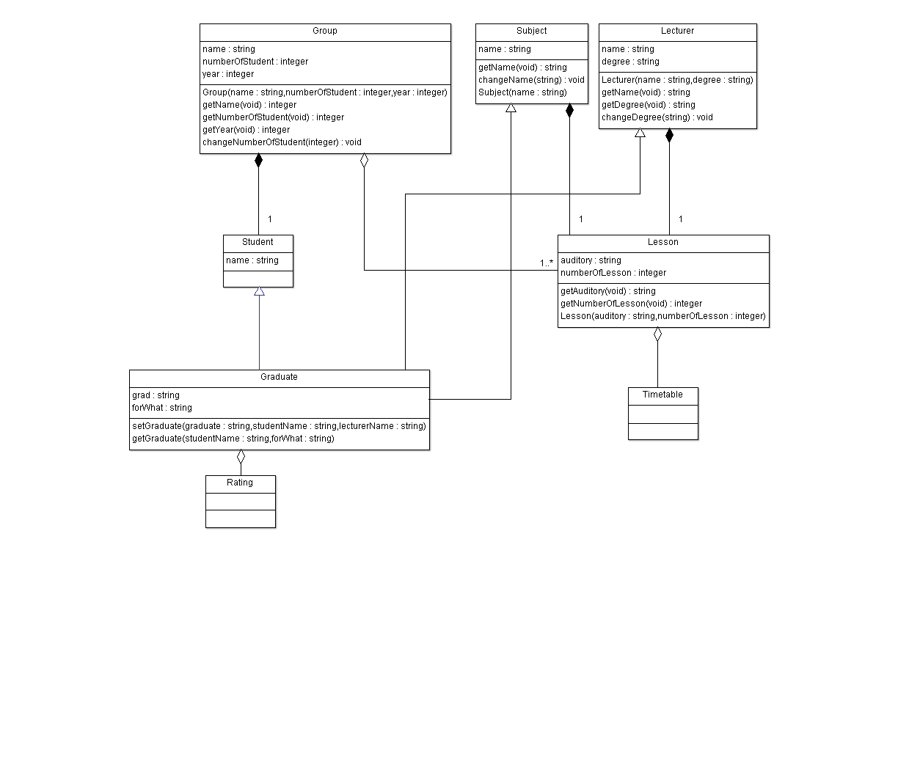

# TimeTable

В даному поекті користувачем буде виступати студент. Авторизуючись йому буде представлено його розклад. розклад ми розбили на пари (можна пронумерувати кожну пару за 2 тижні), розклад - це n пар, тому ми взяли агрегацію, кожна пара проводиться у певній аудиторії(власний атрибут), її може вести 1 викладач по одному предмету, але з кількома групами. Оскільки всі ці три складові (вірніше, їх атрибути, методи) не перемішуються, а є окремою складовою, то ми взяли теж агрегацію. За бажанням корситувач може перейти на сторінку свого рейтингу. Рейтинг - аналогічно буде складатись із оцінок, кожна оцінка виставляється 1 студенту, по 1 предмету, іноді можуть виставляти 2 викладачі, але дисципліну веде 1 викладач, тому можна надати право висталяти оцінки лише йому. І ми взяли що студент наслідує групу, оскільки студент має тіж властивості що й група (назва, рік формування) плюс свої (ПІБ).

 Members' list
=============
1.Дегтярьов Михайло
2.Харамбура Павло
3.Гупало Тетяна

# UML-diagram #

